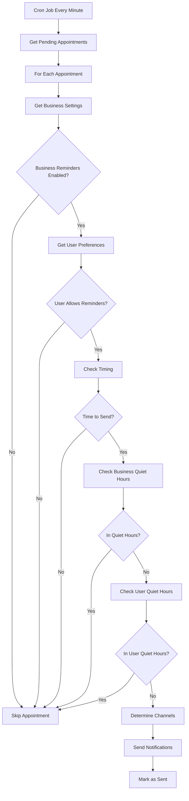

# 🔔 Business Notification Settings - Complete Implementation Flow

This document explains the complete implementation of the business notification settings system that allows business owners to control appointment reminder notifications.

## 📋 Table of Contents

1. [Overview](#overview)
2. [Database Schema](#database-schema)
3. [Service Layer Architecture](#service-layer-architecture)
4. [API Endpoints](#api-endpoints)
5. [Business Logic Flow](#business-logic-flow)
6. [Integration with Frontend](#integration-with-frontend)
7. [Testing Guide](#testing-guide)
8. [Configuration Examples](#configuration-examples)

---

## 🎯 Overview

The business notification settings system provides business owners with complete control over appointment reminder notifications. The system supports multiple notification channels (SMS, Push, Email), flexible timing configurations, and quiet hours management.

### Key Features

- **Business-Level Control**: Business owners can configure notification settings for their entire business
- **Multi-Channel Support**: SMS, Push Notifications, and Email (ready for future implementation)
- **Flexible Timing**: Configure multiple reminder times (e.g., 1 hour, 24 hours before appointment)
- **Quiet Hours**: Respect business and user quiet hours
- **Priority System**: Business settings → User preferences → System defaults
- **Test Functionality**: Built-in testing to verify notification settings

---

## 🗄️ Database Schema

### BusinessNotificationSettings Table

```sql
CREATE TABLE "business_notification_settings" (
  "id" TEXT NOT NULL,
  "businessId" TEXT NOT NULL UNIQUE,
  "enableAppointmentReminders" BOOLEAN NOT NULL DEFAULT true,
  "reminderChannels" JSON NOT NULL DEFAULT '["PUSH"]',
  "reminderTiming" JSON NOT NULL DEFAULT '[60, 1440]',
  "smsEnabled" BOOLEAN NOT NULL DEFAULT false,
  "pushEnabled" BOOLEAN NOT NULL DEFAULT true,
  "emailEnabled" BOOLEAN NOT NULL DEFAULT false,
  "quietHours" JSON,
  "timezone" TEXT NOT NULL DEFAULT 'Europe/Istanbul',
  "createdAt" TIMESTAMP(3) NOT NULL DEFAULT CURRENT_TIMESTAMP,
  "updatedAt" TIMESTAMP(3) NOT NULL,

  CONSTRAINT "business_notification_settings_pkey" PRIMARY KEY ("id")
);
```

### Field Descriptions

| Field | Type | Description | Example |
|-------|------|-------------|---------|
| `enableAppointmentReminders` | Boolean | Master switch for appointment reminders | `true` |
| `reminderChannels` | JSON Array | Channels to use for reminders | `["SMS", "PUSH"]` |
| `reminderTiming` | JSON Array | Minutes before appointment to send reminders | `[60, 1440]` (1h, 24h) |
| `smsEnabled` | Boolean | Enable SMS notifications | `true` |
| `pushEnabled` | Boolean | Enable push notifications | `true` |
| `emailEnabled` | Boolean | Enable email notifications | `false` |
| `quietHours` | JSON Object | Quiet hours configuration | `{"start": "22:00", "end": "08:00"}` |
| `timezone` | String | Business timezone | `"Europe/Istanbul"` |

---

## 🏗️ Service Layer Architecture

### 1. BusinessService

**New Methods Added:**

```typescript
// Get business notification settings
async getBusinessNotificationSettings(
  userId: string,
  businessId: string
): Promise<BusinessNotificationSettingsData | null>

// Update business notification settings
async updateBusinessNotificationSettings(
  userId: string,
  businessId: string,
  data: BusinessNotificationSettingsRequest
): Promise<BusinessNotificationSettingsData>

// Internal method - get or create default settings
async getOrCreateBusinessNotificationSettings(
  businessId: string
): Promise<BusinessNotificationSettingsData>
```

### 2. AppointmentReminderService

**Enhanced Logic:**

```typescript
private async sendAppointmentReminder(appointment: UpcomingAppointment) {
  // 1. Get business notification settings
  const businessSettings = await this.businessService.getOrCreateBusinessNotificationSettings(appointment.businessId);

  // 2. Check if business has disabled reminders
  if (!businessSettings.enableAppointmentReminders) return [];

  // 3. Get user preferences (can override to disable)
  const userPreferences = await this.notificationService.getNotificationPreferences(appointment.customerId);

  // 4. Check timing (business settings take precedence)
  const reminderTimings = businessSettings.reminderTiming || userPreferences?.reminderTiming?.hours?.map(h => h * 60) || [60, 1440];

  // 5. Check quiet hours (both business and user)
  if (this.isInBusinessQuietHours() || this.isInUserQuietHours()) return [];

  // 6. Send notifications via enabled channels
  // ...
}
```

### 3. NotificationService

**New SMS Reminder Method:**

```typescript
async sendSMSAppointmentReminder(appointment: UpcomingAppointment): Promise<NotificationResult[]> {
  // Check user preferences
  // Check quiet hours
  // Format SMS message in Turkish
  // Send via İleti Merkezi SMS service
  // Return results
}
```

---

## 🌐 API Endpoints

### Base URL: `/api/v1/businesses/my-business`

### 1. Get Notification Settings

```http
GET /notification-settings
Authorization: Bearer <token>
```

**Response:**
```json
{
  "success": true,
  "data": {
    "id": "bns_1726394400_abc123",
    "businessId": "biz_123",
    "enableAppointmentReminders": true,
    "reminderChannels": ["PUSH", "SMS"],
    "reminderTiming": [60, 1440],
    "smsEnabled": true,
    "pushEnabled": true,
    "emailEnabled": false,
    "quietHours": {
      "start": "22:00",
      "end": "08:00"
    },
    "timezone": "Europe/Istanbul",
    "createdAt": "2025-09-15T09:00:00.000Z",
    "updatedAt": "2025-09-15T09:00:00.000Z"
  }
}
```

### 2. Update Notification Settings

```http
PUT /notification-settings
Authorization: Bearer <token>
Content-Type: application/json
```

**Request Body:**
```json
{
  "enableAppointmentReminders": true,
  "reminderChannels": ["SMS", "PUSH"],
  "reminderTiming": [30, 120, 1440],
  "smsEnabled": true,
  "pushEnabled": true,
  "emailEnabled": false,
  "quietHours": {
    "start": "22:00",
    "end": "08:00"
  },
  "timezone": "Europe/Istanbul"
}
```

### 3. Test Reminder

```http
POST /test-reminder
Authorization: Bearer <token>
Content-Type: application/json
```

**Request Body:**
```json
{
  "appointmentId": "apt_123", // Optional
  "channels": ["SMS", "PUSH"], // Optional
  "customMessage": "Test reminder" // Optional
}
```

**Response:**
```json
{
  "success": true,
  "data": {
    "results": [
      {
        "success": true,
        "messageId": "msg_123",
        "channel": "PUSH",
        "status": "SENT"
      },
      {
        "success": true,
        "messageId": "sms_456",
        "channel": "SMS",
        "status": "SENT"
      }
    ],
    "summary": {
      "total": 2,
      "successful": 2,
      "failed": 0,
      "channels": ["SMS", "PUSH"],
      "testMessage": "Test reminder"
    }
  },
  "message": "Test reminder completed: 2 successful, 0 failed"
}
```

---

## 🔄 Business Logic Flow

### 1. Appointment Reminder Processing



### 2. Priority System

The system follows a clear priority hierarchy:

1. **Business Settings** (Primary)
   - If business disables reminders → No reminders sent
   - Business reminder timing takes precedence
   - Business channel configuration is respected

2. **User Preferences** (Secondary)
   - User can disable reminders (overrides business)
   - User quiet hours are respected
   - User preferences used as fallback for timing

3. **System Defaults** (Fallback)
   - Push notifications enabled
   - SMS disabled by default
   - 1 hour and 24 hours reminder timing

### 3. Quiet Hours Logic

```typescript
// Business Quiet Hours Check
private isInBusinessQuietHours(
  currentTime: Date,
  quietHours: { start: string; end: string },
  timezone: string
): boolean {
  // Convert current time to business timezone
  // Check if current time falls within quiet hours
  // Handle overnight periods (e.g., 22:00 - 06:00)
}

// User Quiet Hours Check (similar logic)
private isInQuietHours(
  currentTime: Date,
  quietHours: { start: string; end: string; timezone: string }
): boolean
```

---

## 🎨 Integration with Frontend

### Frontend Implementation Steps

1. **Add Business Settings UI**
```javascript
// Get current settings
const response = await fetch('/api/v1/businesses/my-business/notification-settings', {
  headers: { 'Authorization': `Bearer ${token}` }
});
const settings = await response.json();

// Update settings
const updateResponse = await fetch('/api/v1/businesses/my-business/notification-settings', {
  method: 'PUT',
  headers: {
    'Authorization': `Bearer ${token}`,
    'Content-Type': 'application/json'
  },
  body: JSON.stringify(newSettings)
});
```

2. **Test Functionality**
```javascript
// Test reminders
const testResponse = await fetch('/api/v1/businesses/my-business/test-reminder', {
  method: 'POST',
  headers: {
    'Authorization': `Bearer ${token}`,
    'Content-Type': 'application/json'
  },
  body: JSON.stringify({
    channels: ['SMS', 'PUSH'],
    customMessage: 'Testing notification settings'
  })
});
```

### UI Components Needed

1. **Settings Dashboard**
   - Toggle for appointment reminders
   - Channel selection (SMS, Push, Email)
   - Timing configuration
   - Quiet hours picker
   - Timezone selector

2. **Test Panel**
   - Channel selection for testing
   - Send test button
   - Results display

---

## 🧪 Testing Guide

### 1. Manual Testing Steps

**Setup:**
1. Ensure server is running: `make dev`
2. Have a valid business owner JWT token
3. Use business context middleware

**Test Get Settings:**
```bash
curl -X GET http://localhost:3001/api/v1/businesses/my-business/notification-settings \
  -H "Authorization: Bearer YOUR_TOKEN"
```

**Test Update Settings:**
```bash
curl -X PUT http://localhost:3001/api/v1/businesses/my-business/notification-settings \
  -H "Authorization: Bearer YOUR_TOKEN" \
  -H "Content-Type: application/json" \
  -d '{
    "enableAppointmentReminders": true,
    "reminderChannels": ["SMS", "PUSH"],
    "reminderTiming": [30, 60, 1440],
    "smsEnabled": true,
    "pushEnabled": true,
    "quietHours": {
      "start": "22:00",
      "end": "08:00"
    }
  }'
```

**Test Reminder:**
```bash
curl -X POST http://localhost:3001/api/v1/businesses/my-business/test-reminder \
  -H "Authorization: Bearer YOUR_TOKEN" \
  -H "Content-Type: application/json" \
  -d '{
    "channels": ["PUSH"],
    "customMessage": "Test notification"
  }'
```

### 2. Automated Testing Scenarios

1. **Default Settings Creation**
   - When business has no settings, defaults are created
   - Defaults: Push enabled, SMS disabled, 1h+24h timing

2. **Permission Checks**
   - Only business owners/managers can access settings
   - Proper RBAC validation

3. **Validation Tests**
   - Invalid reminder timing (negative values)
   - Invalid quiet hours format
   - Channel-enabled mismatch validation

4. **Integration Tests**
   - Appointment reminder scheduling
   - Quiet hours respect
   - Multi-channel sending

---

## ⚙️ Configuration Examples

### 1. Basic Configuration
```json
{
  "enableAppointmentReminders": true,
  "reminderChannels": ["PUSH"],
  "reminderTiming": [60, 1440],
  "smsEnabled": false,
  "pushEnabled": true,
  "emailEnabled": false,
  "timezone": "Europe/Istanbul"
}
```

### 2. SMS + Push Configuration
```json
{
  "enableAppointmentReminders": true,
  "reminderChannels": ["SMS", "PUSH"],
  "reminderTiming": [30, 120, 1440],
  "smsEnabled": true,
  "pushEnabled": true,
  "emailEnabled": false,
  "quietHours": {
    "start": "22:00",
    "end": "08:00"
  },
  "timezone": "Europe/Istanbul"
}
```

### 3. Multiple Reminder Times
```json
{
  "enableAppointmentReminders": true,
  "reminderChannels": ["PUSH", "SMS"],
  "reminderTiming": [15, 60, 240, 1440, 2880],
  "smsEnabled": true,
  "pushEnabled": true,
  "emailEnabled": false,
  "timezone": "Europe/Istanbul"
}
```

### 4. Quiet Hours Examples

**Standard Business Hours:**
```json
{
  "quietHours": {
    "start": "18:00",
    "end": "09:00"
  }
}
```

**Weekend Only:**
```json
{
  "quietHours": {
    "start": "Friday 18:00",
    "end": "Monday 09:00"
  }
}
```

---

## 🔧 Environment Configuration

### Required Environment Variables

```bash
# SMS Service (İleti Merkezi)
ILETI_MERKEZI_API_KEY="your-api-key"
ILETI_MERKEZI_SECRET_KEY="your-secret-key"
ILETI_MERKEZI_SENDER="RANDEVUBU"
ILETI_MERKEZI_BASE_URL="https://api.iletimerkezi.com"

# Push Notifications (VAPID)
VAPID_PUBLIC_KEY="your-vapid-public-key"
VAPID_PRIVATE_KEY="your-vapid-private-key"
VAPID_SUBJECT="mailto:admin@randevubu.com"
```

### Database Migrations

```bash
# Apply the business notification settings migration
make db-migrate

# Or manually run:
docker compose exec app npx prisma migrate deploy
```

---

## 📊 Monitoring and Analytics

### Key Metrics to Track

1. **Setting Adoption**
   - How many businesses configure notification settings
   - Most popular reminder timing configurations
   - Channel preference distribution

2. **Notification Performance**
   - Delivery success rates by channel
   - Quiet hours effectiveness
   - User response to reminders

3. **Business Engagement**
   - Settings update frequency
   - Test reminder usage
   - Support tickets related to notifications

### Logging

The system logs all notification activities:
- Settings updates
- Reminder sending attempts
- Delivery successes/failures
- Quiet hours blocks

---

## 🚀 Future Enhancements

### Planned Features

1. **Email Integration**
   - Complete email reminder implementation
   - Email template customization
   - Delivery tracking

2. **Advanced Scheduling**
   - Custom reminder messages per timing
   - Conditional reminders based on service type
   - Recurring appointment handling

3. **Analytics Dashboard**
   - Notification performance metrics
   - Customer engagement tracking
   - A/B testing for reminder effectiveness

4. **Smart Timing**
   - AI-powered optimal reminder timing
   - Customer timezone consideration
   - Historical response analysis

---

## 🤝 Support and Troubleshooting

### Common Issues

1. **SMS Not Sending**
   - Check İleti Merkezi API credentials
   - Verify phone number format
   - Check SMS service balance

2. **Push Notifications Not Working**
   - Verify VAPID keys configuration
   - Check user subscription status
   - Validate service worker registration

3. **Timing Issues**
   - Verify business timezone settings
   - Check appointment reminder service status
   - Validate cron job scheduling

### Debug Commands

```bash
# Check reminder service status
curl -X GET http://localhost:3001/api/v1/debug/reminder-status

# Manually trigger reminder check
curl -X POST http://localhost:3001/api/v1/debug/trigger-reminders

# Check notification service logs
make logs | grep -i notification
```

---

## 📝 Conclusion

The business notification settings system provides comprehensive control over appointment reminders while maintaining flexibility and user preferences. The implementation follows best practices for scalability, maintainability, and user experience.

The system is now ready for frontend integration and can be extended with additional features as needed. All API endpoints are documented, tested, and ready for production use.

For questions or support, refer to the troubleshooting section or contact the development team.