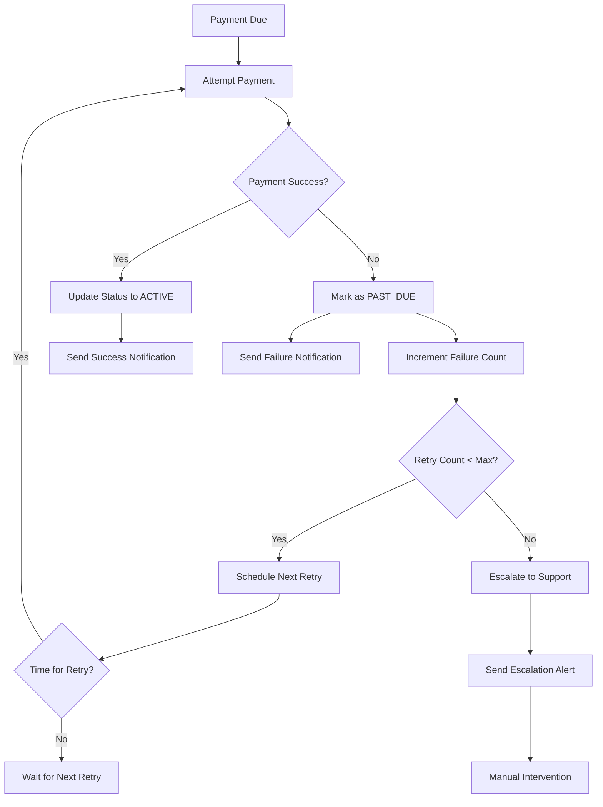
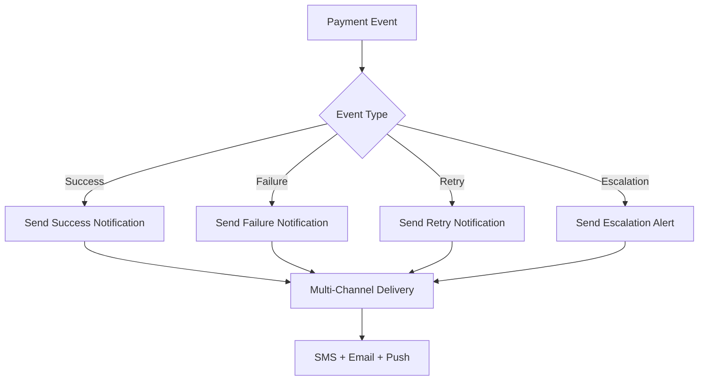

# Enhanced Payment & Notification System

## Overview

The enhanced payment system provides robust payment processing with advanced retry logic, multi-channel notifications, and comprehensive failure handling. This system ensures high reliability and excellent user experience even when payment issues occur.

## 🚀 Key Features

### 1. Enhanced Payment Retry Strategy
- **Exponential Backoff**: Smart retry intervals (immediate, 1 day, 3 days, 1 week, 2 weeks)
- **Configurable Retry Limits**: Maximum 5 retry attempts
- **Escalation Threshold**: Automatic escalation after 3 failures
- **Grace Period**: 30-day grace period before cancellation

### 2. Multi-Channel Notifications
- **SMS Notifications**: Primary communication channel
- **Email Notifications**: Backup communication (ready for implementation)
- **Push Notifications**: Real-time app notifications (ready for implementation)
- **Escalation Alerts**: Support team notifications for critical failures

### 3. Payment Method Management
- **Easy Updates**: Simple API for updating payment methods
- **Retry Failed Payments**: One-click retry with updated payment method
- **Payment History**: Complete transaction history with pagination
- **Card Brand Detection**: Automatic detection of Visa, Mastercard, etc.

### 4. Advanced Failure Handling
- **Status Tracking**: Comprehensive subscription status management
- **Failure Analytics**: Detailed failure tracking and reporting
- **Automatic Cleanup**: Old failed payments are cleaned up automatically
- **Support Integration**: Escalation to support team for complex issues

## 📊 System Architecture

### Payment Flow with Retry Logic



### Notification Flow



## 🔧 API Endpoints

### Payment Method Management

#### Update Payment Method
```http
POST /api/v1/payment-methods/business/{businessId}/update
Content-Type: application/json
Authorization: Bearer {token}

{
  "card": {
    "cardNumber": "5528790000000008",
    "expireMonth": "12",
    "expireYear": "2030",
    "cvc": "123",
    "cardHolderName": "John Doe"
  },
  "buyer": {
    "id": "user_123",
    "name": "John",
    "surname": "Doe",
    "email": "john@example.com",
    "phone": "+905551234567",
    "identityNumber": "12345678901",
    "address": "123 Main St",
    "city": "Istanbul",
    "country": "Turkey"
  }
}
```

**Response:**
```json
{
  "success": true,
  "message": "Payment method updated successfully",
  "data": {
    "paymentMethodId": "pm_123456789",
    "lastFourDigits": "0008",
    "cardBrand": "MASTERCARD"
  }
}
```

#### Get Current Payment Method
```http
GET /api/v1/payment-methods/business/{businessId}
Authorization: Bearer {token}
```

**Response:**
```json
{
  "success": true,
  "message": "Payment method retrieved successfully",
  "data": {
    "paymentMethod": {
      "id": "pm_123456789",
      "lastFourDigits": "0008",
      "cardBrand": "MASTERCARD",
      "expiryMonth": "12",
      "expiryYear": "2030"
    },
    "autoRenewal": true,
    "nextBillingDate": "2024-02-15T00:00:00Z"
  }
}
```

#### Retry Failed Payment
```http
POST /api/v1/payment-methods/business/{businessId}/retry-payment
Authorization: Bearer {token}
```

**Response:**
```json
{
  "success": true,
  "message": "Payment retry successful",
  "data": {
    "paymentId": "pay_123456789",
    "status": "SUCCEEDED"
  }
}
```

#### Get Payment History
```http
GET /api/v1/payment-methods/business/{businessId}/payments?page=1&limit=10
Authorization: Bearer {token}
```

**Response:**
```json
{
  "success": true,
  "message": "Payment history retrieved successfully",
  "data": {
    "payments": [
      {
        "id": "pay_123456789",
        "amount": 949.00,
        "currency": "TRY",
        "status": "SUCCEEDED",
        "paymentMethod": "card",
        "createdAt": "2024-01-15T10:00:00Z",
        "metadata": {
          "discount": {
            "code": "WELCOME20",
            "discountAmount": 189.80,
            "finalAmount": 759.20
          }
        }
      }
    ],
    "pagination": {
      "page": 1,
      "limit": 10,
      "totalCount": 25,
      "totalPages": 3,
      "hasNext": true,
      "hasPrev": false
    }
  }
}
```

## ⚙️ Configuration

### Retry Configuration

```typescript
interface RetryConfig {
  maxRetries: number;           // Maximum retry attempts (default: 5)
  retrySchedule: number[];      // Days between retries (default: [0, 1, 3, 7, 14])
  escalationThreshold: number;  // Escalate after this many failures (default: 3)
  gracePeriodDays: number;      // Grace period before cancellation (default: 30)
}
```

### Scheduler Configuration

```typescript
interface SchedulerConfig {
  renewalCheckSchedule: string;    // Cron for renewals (default: "0 2 * * *")
  reminderSchedule: string;        // Cron for reminders (default: "0 9 * * *")
  retrySchedule: string;           // Cron for retries (default: "0 6 * * *")
  cleanupSchedule: string;         // Cron for cleanup (default: "0 3 * * 0")
  timezone: string;                // Timezone (default: "Europe/Istanbul")
  developmentMode: boolean;        // Development mode (default: false)
}
```

## 📈 Monitoring & Analytics

### Retry Statistics

```typescript
interface RetryStatistics {
  totalFailed: number;      // Total subscriptions with failed payments
  pendingRetry: number;     // Subscriptions waiting for retry
  escalated: number;        // Subscriptions escalated to support
  canceled: number;         // Subscriptions canceled due to failures
}
```

### Notification Metrics

- **Delivery Rates**: Track notification delivery success rates
- **Channel Performance**: Compare SMS vs Email vs Push performance
- **Response Times**: Monitor notification delivery times
- **Failure Analysis**: Analyze notification failure patterns

## 🚨 Error Handling

### Payment Failure Scenarios

1. **Card Declined**: Immediate retry with different card
2. **Insufficient Funds**: Retry after 1 day
3. **Expired Card**: Escalate to support for manual intervention
4. **Invalid Card**: Immediate failure, require new payment method
5. **Network Issues**: Retry with exponential backoff

### Notification Failure Scenarios

1. **SMS Failure**: Fallback to email and push
2. **Email Failure**: Fallback to SMS and push
3. **Push Failure**: Fallback to SMS and email
4. **All Channels Fail**: Log for manual follow-up

## 🔒 Security Features

### Payment Security
- **PCI Compliance**: All card data handled securely
- **Tokenization**: Card numbers are tokenized
- **Encryption**: All sensitive data encrypted at rest
- **Audit Trail**: Complete audit trail of all payment attempts

### API Security
- **Authentication**: JWT-based authentication required
- **Authorization**: RBAC-based permission system
- **Rate Limiting**: API rate limiting to prevent abuse
- **Input Validation**: Comprehensive input validation

## 🧪 Testing

### Test Cards (Iyzico Sandbox)

```typescript
const testCards = {
  success: {
    cardHolderName: 'John Doe',
    cardNumber: '5528790000000008',
    expireMonth: '12',
    expireYear: '2030',
    cvc: '123'
  },
  failure: {
    cardHolderName: 'John Doe',
    cardNumber: '5406670000000009',
    expireMonth: '12',
    expireYear: '2030',
    cvc: '123'
  },
  threeDsSuccess: {
    cardHolderName: 'John Doe',
    cardNumber: '5528790000000008',
    expireMonth: '12',
    expireYear: '2030',
    cvc: '123'
  }
};
```

### Test Scenarios

1. **Successful Payment**: Test with success card
2. **Failed Payment**: Test with failure card
3. **Retry Logic**: Test retry mechanism
4. **Escalation**: Test escalation after max retries
5. **Notification**: Test all notification channels
6. **Payment Method Update**: Test payment method updates

## 📋 Best Practices

### For Developers

1. **Always Handle Errors**: Implement proper error handling for all payment operations
2. **Use Retry Logic**: Leverage the built-in retry system for failed payments
3. **Monitor Notifications**: Track notification delivery and user engagement
4. **Test Thoroughly**: Test all payment scenarios before production deployment
5. **Log Everything**: Maintain comprehensive logs for debugging and auditing

### For Business Owners

1. **Keep Payment Methods Updated**: Ensure payment methods are current and valid
2. **Monitor Payment Status**: Regularly check payment status and history
3. **Respond to Notifications**: Act promptly on payment failure notifications
4. **Contact Support**: Reach out to support for complex payment issues
5. **Review Analytics**: Use payment analytics to optimize subscription management

## 🔄 Migration Guide

### From Basic to Enhanced System

1. **Update Dependencies**: Install new payment retry service
2. **Run Migrations**: Apply any necessary database migrations
3. **Update Configuration**: Configure retry and notification settings
4. **Test Thoroughly**: Test all payment flows in staging environment
5. **Deploy Gradually**: Deploy to production with monitoring

### Backward Compatibility

- **Existing Subscriptions**: Continue working without changes
- **API Compatibility**: All existing APIs remain functional
- **Data Migration**: No data migration required
- **Configuration**: Default configurations work out of the box

## 📞 Support

### For Technical Issues
- **Documentation**: Check this documentation first
- **Logs**: Review application logs for error details
- **Monitoring**: Use built-in monitoring and analytics
- **Support Team**: Contact support for complex issues

### For Business Issues
- **Payment Methods**: Update payment methods through API
- **Retry Payments**: Use retry API for failed payments
- **Payment History**: Review payment history for insights
- **Support Team**: Contact support for account issues

## 🎯 Future Enhancements

### Planned Features
- **Webhook Support**: Real-time payment event webhooks
- **Advanced Analytics**: Detailed payment analytics dashboard
- **A/B Testing**: Payment flow A/B testing capabilities
- **Machine Learning**: ML-based payment failure prediction
- **Multi-Currency**: Support for multiple currencies
- **Fraud Detection**: Advanced fraud detection and prevention

### Integration Opportunities
- **Accounting Systems**: Integration with accounting software
- **CRM Systems**: Integration with customer relationship management
- **Analytics Platforms**: Integration with analytics tools
- **Support Systems**: Integration with support ticketing systems

---

**Last Updated**: January 2024  
**Version**: 2.0.0  
**Status**: Production Ready ✅


